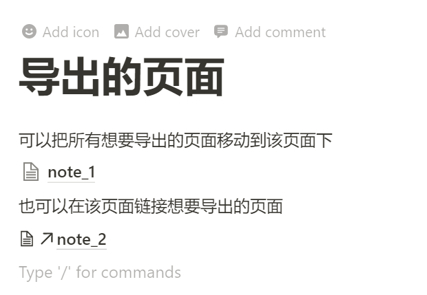

# notion2md
Export Notion page to markdown format file.

This exporter is using the [Notion.so API](https://github.com/jamalex/notion-py) (version: 0.0.28).

---

自从发现了 Notion 这个软件，我就很喜欢它的风格。因此我尝试把它作为我的个人笔记软件记录各种东西。在使用过程中，我对Notion官方的导出功能效果不太满意。

因此我根据 Notion 的第三方 API 尝试重写了 Notion 页面导出为 Markdown 文档的功能。

现在只实现了部分的导出效果。最终目标是基本的内容可以很好地导出为md文件的格式，而一些 Notion 的特性（例如分栏显示、database）的导出效果则无法强求。

## 使用方法

1. 新建一个页面，该页面在最上面一层（即没有父页面），将要导出的所有页面移动到该页面，或者在该页面**链接**想要导出的页面。复制该页面的链接 `url`。

        

3. 运行`main.py`文件，输出账户对应的`token_v2`与待导出页面的`url`。（[如何获取`token_v2`](https://www.redgregory.com/notion/2020/6/15/9zuzav95gwzwewdu1dspweqbv481s5))

## 功能介绍

### Basic block

- [x] 普通文本（text）
- [x] 子页面（page）：创建一个与子页面同名的文件夹存放子页面转换的 md 文件
- [x] 链接的页面（link to page）：与子页面相同处理
- [x] To-do list，无序号列表（Bulleted list），数字列表（Numbered list）
- [x] 可折叠列表（Toggle list） 输出为无序号列表
- [x] 三级标题 Heading1，Heading 2，Heading 3
- [x] 引用（quote）
- [x] 分割线（divider）
- [x] 重点标注（callout）输出为以💡开头的引用内容格式

### Inline 

- [x] **加粗**，*斜体*，~~删除线~~，``单行代码``, 行内公式(例如$e^{i\pi}+1=0$)，含[链接的文本](https://github.com/tanyingkongxin/notion2md) （注：下划线不处理，因为Markdown无下划线的原生语法）

  - [ ] Notion 的文本可以添加各种颜色，而 Markdown 中只有==黄色的高亮语法==，因此不打算处理

- [ ] 正常显示 emoij，例如​ :happy:, 💡

- [ ] 人名引用（Mention a person），日期（Date of reminder）（重要性不高，延后考虑）

  

  

- [x] 行内页面引用（Mention a page）：转换为`[[引用的页面]]`表示，该形式可以在Obsidian，Roam Research等软件链接到页面。

  - [ ] 不足之处：行内引用的页面未下载

### Database

Database 是 Notion 自身的特性，输出到 Markdown 文档中自然会有很多功能用不了。其实从另一方面来说，当我们选择输出为 Markdown 格式的文档时，我们就不需要太多复杂的功能，只需要满足我们基本的写作、笔记功能即可。因此不建议导出具有 Database 的 Notion 页面为 Markdown 文档。

已实现的功能：

- [x] 将不带有子页面的`Table`输出为 Markdown 格式的表格。
- [x] 格中大部分的`Basic`属性都能正常转换，包含：Text, Number, Select, Multi-select, Date, Person, Checkbox, URL, Email, Phone；而部分`Advanced`属性可以转换，如 Create time, Create by, Last edited time, Last edited by。
- [x] 有子页面的`Table`输出为 Markdown 格式的表格，子页面也会导出成 md 文件。
- [x] 个页面的表格（Table-Full page）的导出

考虑实现的功能：

- [ ] 有 File&media 属性的表格导出时能下载对应的文件，并在表格中通过链接显示；

剩余的属性：Formula, Relation, Rollup 就不考虑实现导出了（没必要也不会: )

不足之处：目前导出的表格的列的顺序，只能保证 `Name`在第一列，其余列的顺序可能会被打乱。例如你的 Notion 表格列的顺序为“Name, Text, Number, Select”，导出为 Markdown 的表格列的顺序可能会变成“Name, Select, Text, Number”。该原因在于 Notion.so API 的逻辑，暂时无法解决。

 ### Media
- [x] 图像（Image）
- [x] 书签（Web bookmark）
- [x] 代码块（Code）
- [ ] 视频（Video），音频（Audio）
- [ ] 文档（File）

### Advanced blocks

- [x] 目录（Table of content）
- [x] 公式块（Block equation）

## 参考

[Eunchan Cho(@echo724)\'s notion2md](https://github.com/echo724/notion2md)